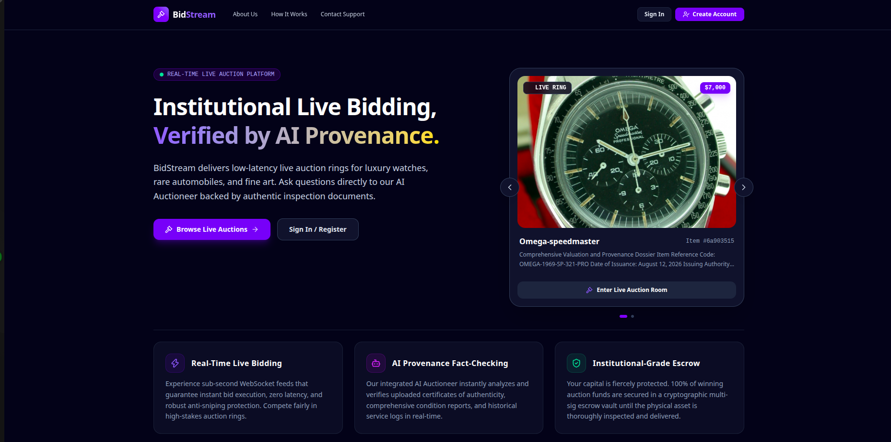
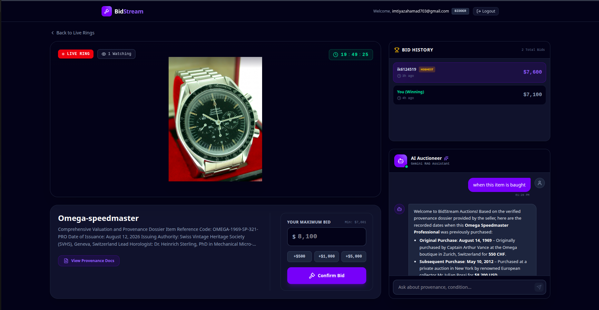
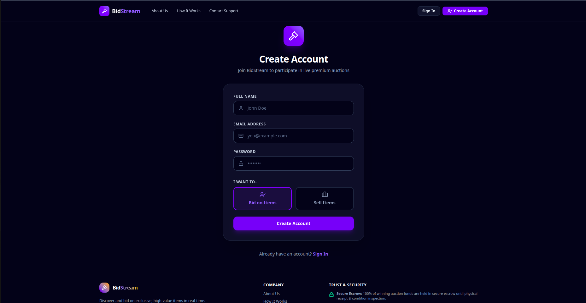
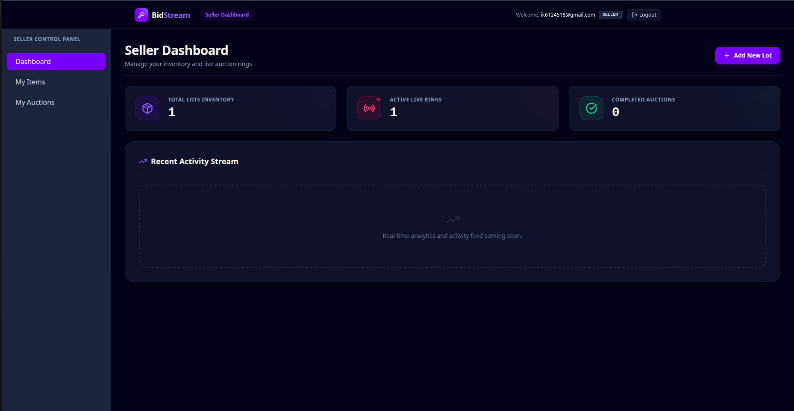
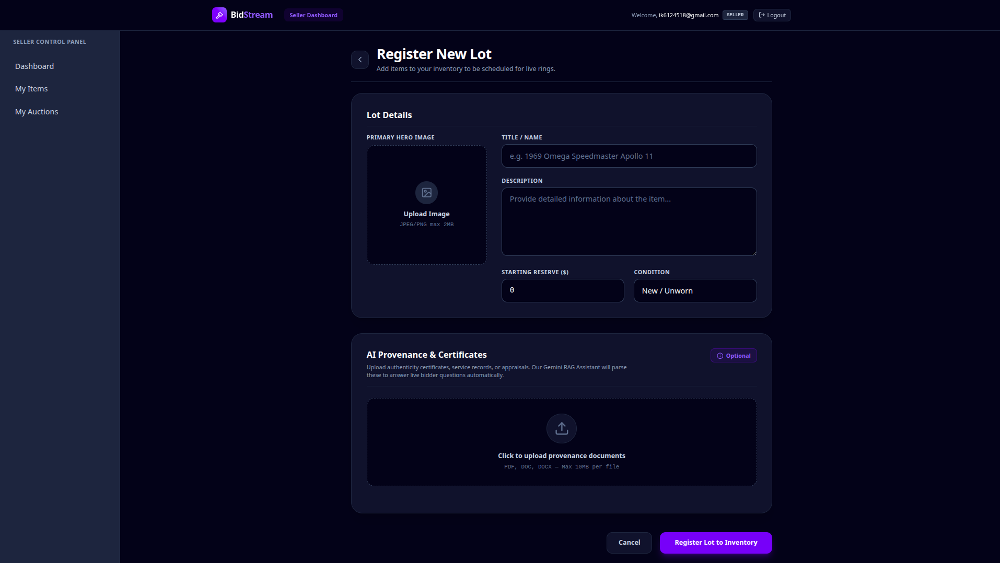
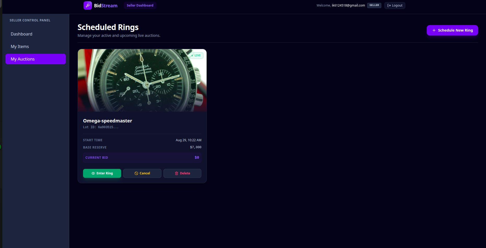
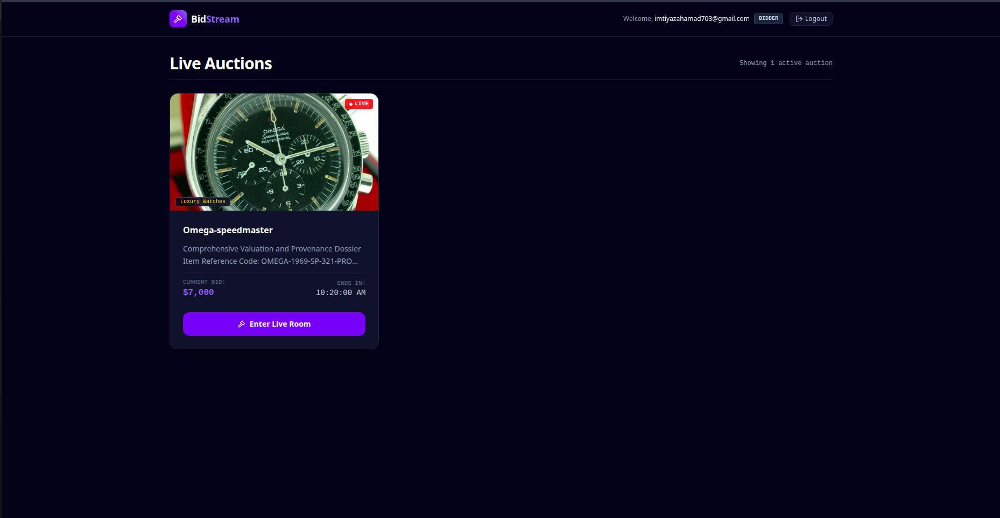

  

  <h1>⚖️ AI BidStream</h1>
  
<strong>Institutional-Grade Live Auction Platform Verified by AI Provenance</strong>

---

## 🌟 Overview

**AI BidStream** is a real-time, enterprise-grade auction platform designed for high-value assets like luxury watches, fine art, and rare automobiles. It provides a secure, low-latency live bidding environment with built-in AI fact-checking to guarantee authenticity.

Powered by advanced AI integrations (Google Gemini) and a high-performance backend architecture (Spring Boot, Kafka, Redis, WebSockets), this platform ensures sub-second bid execution, zero lag, and instant verification of provenance documents.

---

## 📸 Platform Experience

  

### Feature Showcase

| Landing Page | Registration & Auth |
|:---:|:---:|
|  |  |

| Seller Dashboard | Item Registration |
|:---:|:---:|
|  |  |

| Scheduled Auctions | Buyer Dashboard |
|:---:|:---:|
|  |  |

| Live Auction Room & AI Chat |
|:---:|
|  |

---

## 🚀 Key Features

*   ⚡ **Real-Time Live Bidding:** Sub-second WebSocket feeds guarantee instant bid execution, zero latency, and robust anti-sniping protection.
*   🤖 **AI Provenance Fact-Checking:** Our integrated AI Auctioneer instantly analyzes and verifies uploaded certificates of authenticity and condition reports in real-time.
*   🛡️ **Institutional-Grade Escrow:** 100% of winning auction funds are secured in a cryptographic multi-sig escrow vault until the physical asset is thoroughly inspected and delivered.
*   📊 **Seller & Buyer Dashboards:** Comprehensive portals for tracking active bids, scheduled auctions, and item catalogs.
*   🔐 **Secure Authentication:** JWT-based secure user authentication and role-based access control via Spring Security.

---

## 🛠️ Technology Stack & Architecture

This project is built using a highly scalable, event-driven microservices architecture:

### 1. Frontend (Client-Side UI)
*   **Framework:** React (Vite) + TypeScript
*   **Styling:** TailwindCSS with modern Glassmorphism aesthetics
*   **State Management:** Zustand
*   **Real-time Communication:** STOMP WebSockets

### 2. Backend (Core Engine)
*   **Framework:** Spring Boot (Java 17)
*   **Security:** Spring Security + JWT
*   **Database (Relational):** MySQL (Users, Bids, Transactions)
*   **Database (NoSQL):** MongoDB (Dynamic Item Catalog, AI Vector Embeddings)
*   **Caching & Locking:** Redis (Highest-Bid Cache, Distributed Locking)
*   **Message Broker:** Apache Kafka (Asynchronous Bid Processing)
*   **AI Integration:** Spring AI + Google Gemini API + PDFBox

---

## 🏗️ Getting Started

### Prerequisites
- Node.js (v18+)
- Java 17
- MySQL, MongoDB, Redis, Kafka
